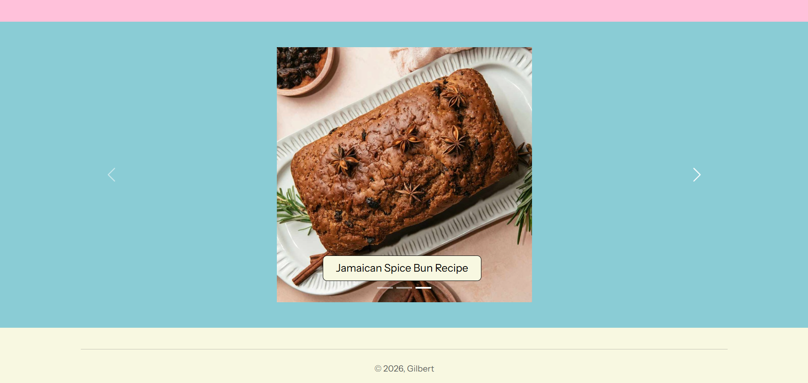
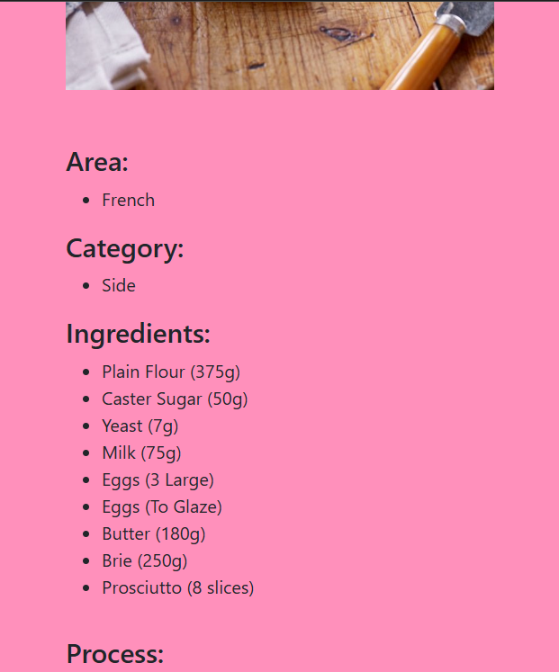
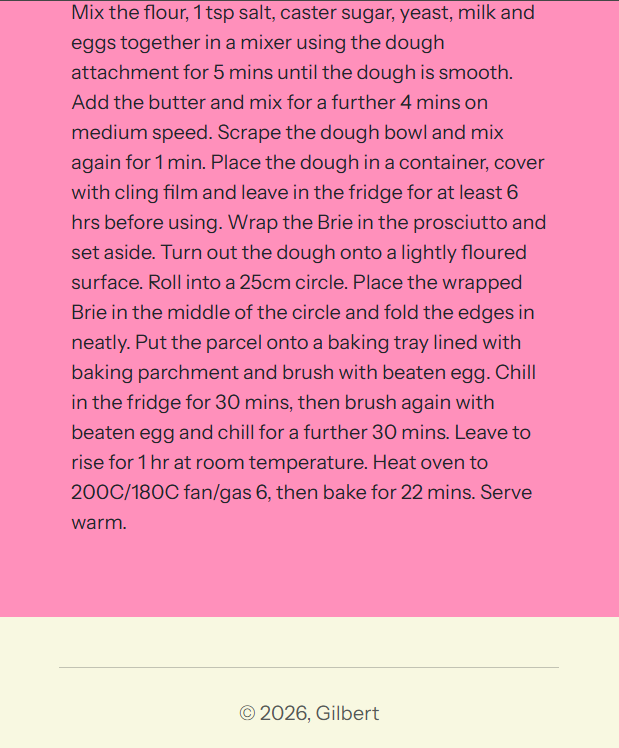
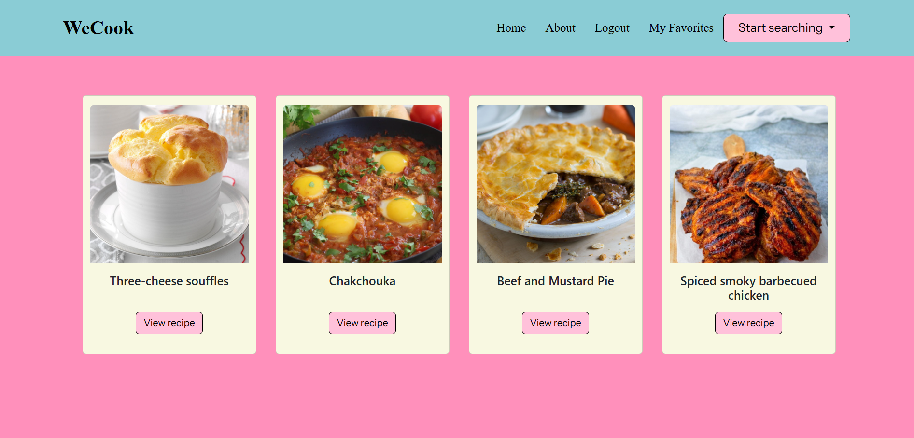

# 🍳 Recipe Web App

A full-stack web application built with Flask that allows users to discover, explore, and save recipes using an external API.

---

## 🌐 Live Demo

*(Coming soon – deployment in progress)*

---

## 🚀 Features

* 🔍 Search recipes by:

  * Category
  * Area
  * Main ingredient
  * Name
* 🎲 Random recipe generator
* 👤 User authentication system:

  * Register / Login / Logout
  * Secure password hashing
* ⭐ Favorite recipes system:

  * Add and remove favorites
  * Personalized user experience
* 📱 Responsive UI built with Bootstrap

---

## 🧠 Architecture Overview

The application follows a simple full-stack architecture:

* Flask handles routing and backend logic
* SQLAlchemy manages database interactions
* Flask-Login handles user sessions and authentication
* External API (TheMealDB) provides recipe data

---

## 🛠️ Tech Stack

* **Backend:** Python, Flask
* **Frontend:** HTML, CSS, Bootstrap
* **Database:** SQLite (SQLAlchemy ORM)
* **Authentication:** Flask-Login, Werkzeug Security
* **API Integration:** TheMealDB
* **Environment Management:** python-dotenv

---

## ⚙️ Installation

1. Clone the repository:

```bash
git clone https://github.com/gilbert-gr/recipe-web-app.git
cd recipe-web-app
```

2. Install dependencies:

```bash
pip install -r requirements.txt
```

3. Create a `.env` file:

```env
API_KEY=your_api_key
APP_SECRET_KEY=your_secret_key
```

4. Run the application:

```bash
python main.py
```

---

## 🗄️ Database

* SQLite database is created automatically on first run
* Stores:

  * User credentials (securely hashed)
  * Favorite recipes linked to users

---

## 📸 Screenshots

### Homepage:





### Recipes page (Mobile view):






### Favorites:



---


## 👨‍💻 Author

* GitHub: https://github.com/gilbert-gr
